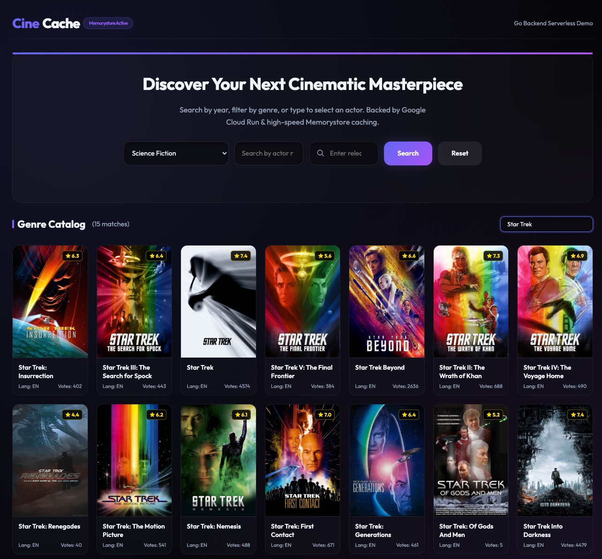
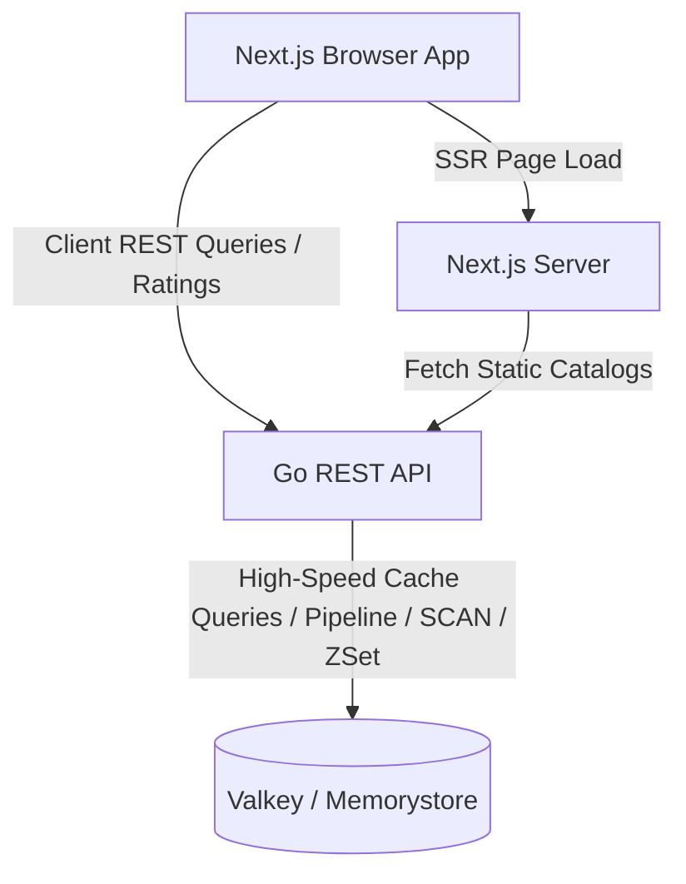

# CineCache: Valkey-Powered Movie Showcase

CineCache is a serverless web application demonstrating high-performance database interaction and caching patterns using **Valkey** (the high-performance open-source key-value store). The project is built with a Go API backend and a Next.js frontend, designed to run in containerized environments like Google Cloud Run with Google Cloud Memorystore.



---

## Architecture Overview

The application consists of three primary components:

1. **Frontend (Next.js)**: A React 19-based client using the App Router and a custom dark-themed glassmorphism design system. It pre-fetches static lists (such as movie genres) during server-side rendering (SSR) to accelerate initial load times, and utilizes client-side requests for interactive searching, paginated browsing, and ratings.
2. **Backend (Go)**: A lightweight HTTP API server utilizing Go 1.22 parameterized routing (`net/http`). It connects to Valkey using the Go client library (`github.com/redis/go-redis/v9` which is fully compatible with Valkey) and exposes REST endpoints with optimized connection pool configurations.
3. **Database (Valkey)**: A fast, in-memory data store containing pre-seeded movie metadata, rating relations, actor profiles, and billing information. Valkey handles complex relational querying, paginated lists, and transactional updates.



---

## Key Features & Valkey Integration

This project demonstrates several caching, searching, and structural data patterns using Valkey:

### 1. Pipelining & High-Performance Batching
When retrieving lists of movies (e.g., query by year, genre, or actor), the Go backend avoids repeated network roundtrips to Valkey. It leverages a single pipeline connection (`rdb.Pipeline()`) to fetch multiple movie hashes concurrently, yielding massive latency reductions.

### 2. Text Search and Autocomplete (`SCAN` + Pipeline)
For actor autocomplete queries, the backend performs non-blocking scans across actor keys (`actor:*`) matching substring filters. Using pipelined `HGET` operations, matching results are aggregated, limited to a max count of 10 for speed, and served to the client.

### 3. Multi-criteria Filtering with Sets
Entity groups (such as release years and movie genres) are indexed using Valkey Set types (`SADD`). Filtering operations retrieve set members (`SMEMBERS`) and resolve their detailed records instantly.

### 4. Structured Relationships via Sorted Sets (`ZSet`)
Movie cast billing order requires ordered indexes. CineCache stores movie billing rosters in a Sorted Set (`movie:<id>:cast`) where the member is the actor's name and the score represents the billing priority. Retrievals use `ZRangeWithScores` for sorted array generation.

### 5. Atomic Rating Pipelines (Transactions)
Submitting a rating performs multiple concurrent updates inside an atomic pipeline transaction:
- Persists a rating hash: `rating:<userId>:<movieId>` (score and timestamp).
- Tracks user-to-movie mapping: `SAdd` user ratings and movie ratings indexes.
- Dynamically reads existing averages and increments total vote counts.
- Computes the new average and updates the main movie hash (`movie:<id>`) in-place.

---

## Valkey Data Structure Layout

The CineCache database maps entity schemas to Valkey primitives:

| Key Pattern | Data Type | Purpose | Fields / Description |
|:---|:---|:---|:---|
| `movie:all` | **Set** | Master index of all movie IDs | Set of integers |
| `movie:<movie_id>` | **Hash** | Primary movie metadata attributes | `title`, `vote_average`, `vote_count`, `poster_path`, etc. |
| `genre:<genre_id>` | **Hash** | Genre metadata | `name` |
| `genre:<genre_id>:movies` | **Set** | Movies mapped to a specific genre | Set of movie IDs |
| `movies:year:<year>` | **Set** | Movies released in a specific year | Set of movie IDs |
| `actor:<actor_id>` | **Hash** | Actor profile metadata | `name` |
| `actor:<actor_id>:movies` | **Set** | Movies featuring the actor | Set of movie IDs |
| `director:<director_id>` | **Hash** | Director profile metadata | `name` |
| `director:<director_id>:movies` | **Set** | Movies directed by this director | Set of movie IDs |
| `movie:<movie_id>:cast` | **Sorted Set** | Movie billing cast lineup | **Member:** Name, **Score:** Billing order |
| `movie:<movie_id>:director` | **String** | Director pointer for a movie | Director ID |
| `movie:<movie_id>:genres` | **Set** | Genres mapped to a movie | Set of genre IDs |
| `user:<user_id>:ratings` | **Set** | Movies rated by a user | Set of movie IDs |
| `movie:<movie_id>:ratings` | **Set** | Users who rated a movie | Set of user IDs |
| `rating:<user_id>:<movie_id>` | **Hash** | Specific rating detail record | `rating`, `timestamp` |

---

## Local Setup and Running

To run CineCache locally on your machine, follow these instructions:

### Prerequisites
- **Docker** and **Docker Compose** installed.
- **Go 1.22+** (if running backend natively).
- **Node.js 20+** (if running frontend natively).

### 1. Run Valkey & Import Seed Data
CineCache includes a compressed database backup file containing pre-populated film records (`cinecache-data/cinecache.rdb.gz`). 

1. Decompress the database backup file to create a `dump.rdb` snapshot:
   ```bash
   gunzip -c cinecache-data/cinecache.rdb.gz > cinecache-data/dump.rdb
   ```
2. Start Valkey using Docker, mounting the folder containing your `dump.rdb` file:
   ```bash
   docker run --name valkey-local \
     -p 6379:6379 \
     -v "$(pwd)/cinecache-data:/data" \
     -d valkey/valkey:7.2 \
     --dir /data --dbfilename dump.rdb
   ```
3. Verify Valkey is running and database keys are populated:
   ```bash
   docker exec -it valkey-local valkey-cli ping
   docker exec -it valkey-local valkey-cli SCARD movie:all
   ```

### 2. Run the Go Backend
Navigate to the backend folder, configure connections, and run the server:
```bash
cd cinecache-backend

# Set environment variables (defaults are fine if Valkey is on localhost:6379)
export VALKEY_HOST=localhost
export VALKEY_PORT=6379
export PORT=8080

# Run the service
go run main.go
```
The API server will start listening at [http://localhost:8080](http://localhost:8080). You can verify the API connection by loading:
- [http://localhost:8080/healthz](http://localhost:8080/healthz)
- [http://localhost:8080/api/genres](http://localhost:8080/api/genres)

### 3. Run the Next.js Frontend
Open a new terminal window, navigate to the frontend folder, install dependencies, and launch the client:
```bash
cd cinecache-frontend

# Install package dependencies
npm install

# Set target backend server endpoint
export BACKEND_URL=http://localhost:8080

# Start development server
npm run dev
```
Open [http://localhost:3000](http://localhost:3000) in your browser to access the interactive application.

---

## Production Deployment

Both the frontend and backend directories include `Dockerfile` specifications and `deploy.sh` deployment files targeted at **Google Cloud Run** and **Google Cloud Memorystore for Valkey**.

### Deployment Checklist & GCP Readiness
The CineCache codebase is fully prepared for deployment in a standard **Google Cloud Platform (GCP)** environment using **Google Cloud Run** (for Serverless compute) and **Google Cloud Memorystore for Valkey** (for managed in-memory database). 

To deploy the project:
1. **Infrastructure Setup**: Provision a Google Cloud VPC network and a Serverless VPC Access Connector to enable secure, private communication between Cloud Run and Memorystore.
2. **Memorystore Instance**: Create a Google Cloud Memorystore for Valkey instance within the same region as your compute services.
3. **Secrets & Configuration**: Source and define your custom GCP resources (project ID, target region, VPC connector name, Memorystore instance name, and container repository) in `environment.sh` in the root directory.
4. **Deploy Backend**: Execute `./cinecache-backend/deploy.sh`. This script dynamically resolves your Valkey instance's private IP address, triggers a secure remote container compile using Google Cloud Build, and deploys the Go API service to Cloud Run inside your VPC.
5. **Deploy Frontend**: Execute `./cinecache-frontend/deploy.sh`. This script fetches the live URL of the newly deployed Go backend service, compiles Next.js static assets and pages, and deploys the frontend interface on Cloud Run.
